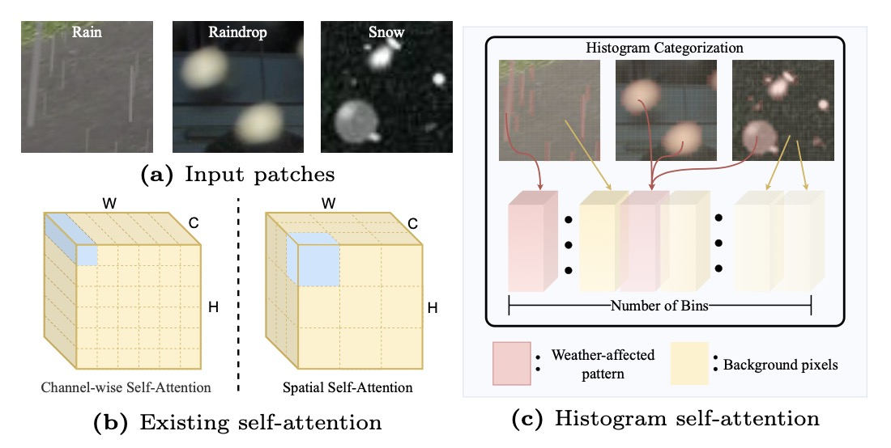
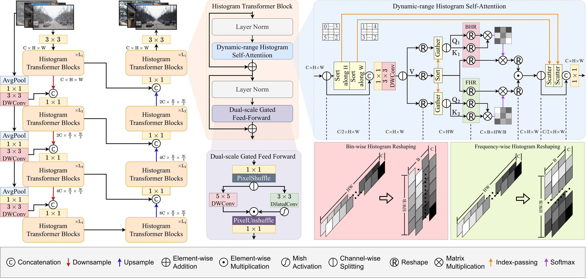
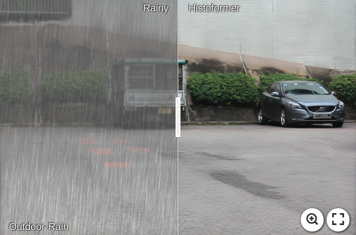
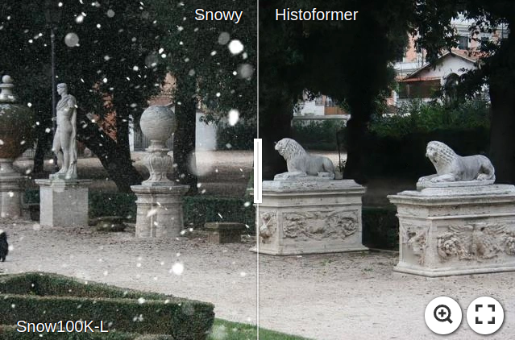
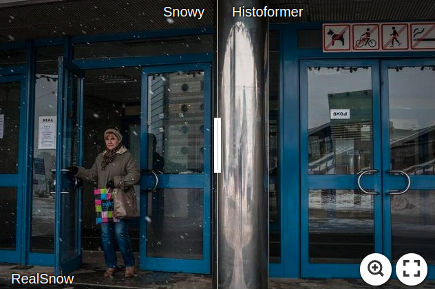

 # <p align=center> [ECCV 2024] Restoring Images in Adverse Weather Conditions via Histogram Transformer</p>

<div align="center">
 
[](https://arxiv.org/abs/2407.10172)
[](https://arxiv.org/abs/2407.10172)
[](https://sunsean21.github.io/restore-all-weather.html)
[](https://sunsean21.github.io/resources/pdf/poster_eccv24_histoformer.pdf)
[](https://sunsean21.github.io/resources/pdf/eccv2024_supp.pdf)     
[](https://zhuanlan.zhihu.com/p/709843922) 
[](https://github.com/sunshangquan/Histoformer/issues?q=is%3Aissue+is%3Aclosed) 
[](https://github.com/sunshangquan/Histoformer/issues) 
[](https://hits.seeyoufarm.com)

</div>

 |   |  
:-------------------------:|:-------------------------:
Cover figure | Network structure

---
>**Restoring Images in Adverse Weather Conditions via Histogram Transformer**<br>  Shangquan Sun, Wenqi Ren, Xinwei Gao, Rui Wang, Xiaochun Cao<br> 
>European Conference on Computer Vision

<details>
<summary><strong>Abstract</strong> (click to expand) </summary>
Transformer-based image restoration methods in adverse weather have achieved significant progress. Most of them use self-attention along the channel dimension or within spatially fixed-range blocks to
reduce computational load. However, such a compromise results in limitations in capturing long-range spatial features. Inspired by the observation that the weather-induced degradation factors mainly cause similar occlusion and brightness, in this work, we propose an efficient Histogram Transformer (Histoformer) for restoring images affected by adverse weather. It is powered by a mechanism dubbed histogram self-attention, which sorts and segments spatial features into intensity-based bins. Self-attention is then applied across bins or within each bin to selectively focus on spatial features of dynamic range and process similar degraded pixels of the long range together. To boost histogram self-attention, we present a dynamic-range convolution enabling conventional convolution to conduct operation over similar pixels rather than neighbor pixels. We also observe that the common pixel-wise losses neglect linear association and correlation between output and ground-truth. Thus, we propose to leverage the Pearson correlation coefficient as a loss function to enforce the recovered pixels following the identical order as ground-truth. Extensive experiments demonstrate the efficacy and superiority of our proposed method.
</details>

## :mega: Citation
If you use Histoformer, please consider citing:

    @article{sun2024restoring,
      title={Restoring Images in Adverse Weather Conditions via Histogram Transformer},
      author={Sun, Shangquan and Ren, Wenqi and Gao, Xinwei and Wang, Rui and Cao, Xiaochun},
      journal={arXiv preprint arXiv:2407.10172},
      year={2024}
    }
    
    @InProceedings{10.1007/978-3-031-72670-5_7,
        author="Sun, Shangquan and Ren, Wenqi and Gao, Xinwei and Wang, Rui and Cao, Xiaochun",
        editor="Leonardis, Ale{\v{s}} and Ricci, Elisa and Roth, Stefan and Russakovsky, Olga and Sattler, Torsten and Varol, G{\"u}l",
        title="Restoring Images in Adverse Weather Conditions via Histogram Transformer",
        booktitle="Computer Vision -- ECCV 2024",
        year="2025",
        publisher="Springer Nature Switzerland",
        address="Cham",
        pages="111--129",
        isbn="978-3-031-72670-5"
    }
---

## :rocket: News
* **2024.10.09**: Upload our work on [HuggingFace Model](https://huggingface.co/sunsean/Histoformer) and [HuggingFace Space](https://huggingface.co/spaces/sunsean/Histoformer).
* **2024.08.29**: Update alternative [[Download Links]](https://github.com/sunshangquan/Histoformer/issues/2) for Snow100K masks as its original link expires.
* **2024.08.29**: Update alternative [[Download Links]](https://github.com/sunshangquan/Histoformer/issues/8) for Outdoor-Rain Test1 as its original link expires.
* **2024.07.23**: Update alternative [[Download Links]](https://github.com/sunshangquan/Histoformer/issues/2) for Snow100K as its original link expires.
* **2024.07.18**: Codes and [pre-trained weights](https://drive.google.com/drive/folders/1dmPhr8Z5iPRx9lh7TwdUFPSfwGIxp5l0?usp=drive_link) are released.
* **2024.07.17**: [Visual results](https://github.com/sunshangquan/Histoformer?tab=readme-ov-file#smile-visual-results) are released.
* **2024.07.14**: [Arxiv Paper](https://export.arxiv.org/abs/2407.10172) is released.
* **2024.07.01**: Histoformer is accepted by ECCV2024.
* **2024.03.01**: Histoformer is rejected by CVPR2024.


## :jigsaw: Datasets

According to [[Issue#2]](https://github.com/sunshangquan/Histoformer/issues/2) and [[Issue#8]](https://github.com/sunshangquan/Histoformer/issues/8), many related datasets are unavailable. 
I have provided them below:

| Snow100K Training | Snow100K Test Set | Snow100K Masks | Outdoor-Rain Test1|
|:---------------:|:-----------------:|:-----------------:|:-----------------:|
| [[Google Drive]](https://drive.google.com/file/d/1tfeBnjZX1wIhIFPl6HOzzOKOyo0GdGHl/view?usp=sharing) | [[Google Drive]](https://drive.google.com/drive/folders/1kLPWAev5f6OutKFALhxthuO1XCF5U1Yu) [[BaiduYun Disk]](https://pan.baidu.com/s/1oiL0IrB1vWo902G-jWk8LA?pwd=yuia) [pin: ```yuia```] | [[Google Drive]](https://drive.google.com/drive/folders/11kGq5VB6hyEx-GTONvH9Z4cH7EhpjaJ_?usp=sharing) [[BaiduYun Disk]](https://pan.baidu.com/s/1Il24NXXt748nsL2nLpXI3g?pwd=hstm) [pin: ```hstm```] | [[Google Drive]](https://drive.google.com/file/d/1xgLG6656ahL7TfpeO_TplkMOQrfdxKbo/view?usp=sharing) |


## :smile: Visual Results 


All visual results are in [Google Drive](https://drive.google.com/drive/folders/1adPVQXePgkhC1Ci82_a6vK6JfMa_KX5m?usp=drive_link) and [Baidu Disk](https://pan.baidu.com/s/1X8zWxmZUdd_CRcQAZOxr3w?pwd=ps9q) (pin: ```ps9q```). 
You can also find each of them from the table below.

<div align="center">

| Method | RainDrop | Outdoor-Rain | Snow100K-L | Snow100K-S  | RealSnow |
|:---------------:|:-----------------:|:-----------------:|:-----------------:|:------------------:|:------------------:|
| [TransWeather](https://drive.google.com/drive/folders/1Ptg1t-6UQIXbXstF2vyJM_POjlCfA8Gt?usp=drive_link) | [Results](<https://drive.google.com/drive/folders/1ZfZcdbFUoKsVuVDGZMRt23fB2s1eQbu9?usp=drive_link>) | [Results](<https://drive.google.com/drive/folders/1zecSVNMTXdIjOtYs5K4NyLjeeljCyj17?usp=drive_link>) | [Results](<https://drive.google.com/file/d/1OjNgaj3FebO6PegWjphd9pFgbBwfaiYZ/view?usp=drive_link>) | [Results](<https://drive.google.com/file/d/1GGWlRLEJ1dKGW8GyMVDkWTmRwgjiE_Hh/view?usp=drive_link>) | [Results](<https://drive.google.com/drive/folders/1kBbPHyNU3wYdGKbTGK0sjnk02s-gLwRx?usp=drive_link>) | 
| [WGWSNet](https://drive.google.com/drive/folders/1iEaAQ3j1DN9jMp_NQB8QJ8ixP_fzM7kK?usp=drive_link) | [Results](<https://drive.google.com/drive/folders/16KmSHDYJNaZiMQ6TLgVGdbOp4Sb4KdkX?usp=drive_link>) | [Results](<https://drive.google.com/drive/folders/1OaFiRX3V5ySTa5KoJ9CBg0sj7AveDnkx?usp=drive_link>) | [Results](<https://drive.google.com/file/d/1WE34HRm6Qx02tJ3rz2lHqQaCHXDHCfmH/view?usp=drive_link>) | [Results](<https://drive.google.com/file/d/1u6K3Gbbm8iq2zSywA3i-a4L18QprH9EM/view?usp=drive_link>) | [Results](<https://drive.google.com/drive/folders/1v2Z_KH0d9zeZFAgUCSuyJPbH_yKvffOL?usp=drive_link>) |
| [Chen et al.](https://drive.google.com/drive/folders/1U9lfCsT6ydm_aP4e20lecLyOm9-nTSk4?usp=drive_link) | [Results](<https://drive.google.com/drive/folders/1Xy_V3PU5zvxsiklW8YMWympIEKP5Y92L?usp=drive_link>) | [Results](<https://drive.google.com/drive/folders/1Ri_ridnMJX7S0gEIbJ6v07WQSaGtfqAB?usp=drive_link>) | [Results](<https://drive.google.com/file/d/1TPNBMVQkGf6cNijvsDrGDIuNBZs59drw/view?usp=drive_link>) | [Results](<https://drive.google.com/file/d/1np_l_Ccs-tsF36AyJTa7x6R9W-hp3Mhi/view?usp=drive_link>) | [Results](<https://drive.google.com/drive/folders/1V6y3Q1AoRD7uGvPFFvH0OiG47tSRVOQd?usp=drive_link>) |  
| [WeatherDiff](https://drive.google.com/drive/folders/1RoMark7UbGB3sOlCEP4hyCiyZyRYg7td?usp=drive_link) | [Results](<https://drive.google.com/drive/folders/1GUc1d03yUilfMqDNIlNB5ZDc8LbKWRav?usp=drive_link>) | [Results](<https://drive.google.com/drive/folders/10obRn4-ZjuB_4-Gz492T-2_41oVdZvky?usp=drive_link>) | [Results](<https://drive.google.com/file/d/1TzHwtCiG8S1O2f2hkQsjyDBAgIOvQhp3/view?usp=drive_link>) | [Results](<https://drive.google.com/file/d/1z4AqpBB_XMXOYGLKqwJSuHRusbEV2n7e/view?usp=drive_link>) | [Results](<https://drive.google.com/drive/folders/1B8D75MowIAjxL17WkukpxjEcW3wi6k-i?usp=drive_link>) | 
| [Histoformer](https://drive.google.com/drive/folders/1Yu6rDU4fCxtddLCsllHIT1OVUXpkhy8h?usp=drive_link) | [Results](<https://drive.google.com/drive/folders/1BducWzQ3AbVahMI2pCJOErajJLvuF3Dh?usp=drive_link>) | [Results](<https://drive.google.com/drive/folders/1oofUMYmeI3zCsMWTssvYrw3i9d4wW8zl?usp=sharing>) | [Results](<https://drive.google.com/file/d/18lJLDfpNNvqZ_5x8y9WYYmtb9jFmBEBD/view?usp=drive_link>) | [Results](<https://drive.google.com/file/d/1LvtLkRau8EtRTsbVGceR0JVO_XoXcGz1/view?usp=drive_link>) | [Results](<https://drive.google.com/drive/folders/1Ia5b3nEL3nJr8mphHhexHLTai1z5Xd3o?usp=drive_link>) | 
</div>

Examples:

[](https://imgsli.com/Mjc5ODI4) | [](https://imgsli.com/Mjc5ODIy)
:-------------------------:|:-------------------------:
RainDrop | Outdoor-Rain 


[](https://imgsli.com/Mjc5ODMw) | [](https://imgsli.com/Mjc5ODMz)
:-------------------------:|:-------------------------:
Snow100K-L | RealSnow 

## :gear: Installation

See [INSTALL.md](INSTALL.md) for the installation of dependencies required to run Histoformer.

## :hammer_and_wrench: Training

1. Download [Training set](https://drive.google.com/file/d/1tfeBnjZX1wIhIFPl6HOzzOKOyo0GdGHl/view?usp=sharing) or each of them, i.e., [Snow100K](https://sites.google.com/view/yunfuliu/desnownet), [Outdoor-Rain](https://github.com/liruoteng/HeavyRainRemoval), and [RainDrop](https://github.com/rui1996/DeRaindrop).

**Note:** The original link for downloading Snow100K has expired, so you could refer to [[Issue#2]](https://github.com/sunshangquan/Histoformer/issues/2) for alternative download links.

2. Modify the configurations of ```dataroot_gt``` and ```dataroot_lq``` for ```train```, ```val_snow_s```, ```val_snow_l```, ```val_test1``` and ```val_raindrop``` in [Allweather/Options/Allweather_Histoformer.yml](Allweather/Options/Allweather_Histoformer.yml)

3. To train Histoformer with default settings, run
```
cd Histoformer
./train.sh Allweather/Options/Allweather_Histoformer.yml 4321
```

**Note:** The above training script uses 4 GPUs by default. 
To use any other settings, for example 8 GPUs, modify ```CUDA_VISIBLE_DEVICES=0,1,2,3,4,5,6,7``` and ```--nproc_per_node=8``` in [Histoformer/train.sh](../train.sh) and ```num_gpu: 8``` [Allweather/Options/Allweather_Histoformer.yml](Allweather/Options/Allweather_Histoformer.yml).


## :balance_scale: Evaluation

0. ```cd Allweather```

1. Download the pre-trained [models](https://drive.google.com/drive/folders/1dmPhr8Z5iPRx9lh7TwdUFPSfwGIxp5l0?usp=drive_link) and place it in `./pretrained_models/`

2. Download test datasets from each of them, i.e., [Snow100K](https://sites.google.com/view/yunfuliu/desnownet), [Outdoor-Rain](https://github.com/liruoteng/HeavyRainRemoval), and [RainDrop](https://github.com/rui1996/DeRaindrop).

3. Test with the replaced argument ```--input_dir [INPUT_FOLDER]```
```
python test_histoformer.py --input_dir [INPUT_FOLDER] --result_dir result/ --weights pretrained_models/net_g_best.pth --yaml_file Options/Allweather_Histoformer.yml

# for realsnow
python test_histoformer.py --input_dir [INPUT_FOLDER] --result_dir result/ --weights pretrained_models/net_g_real.pth --yaml_file Options/Allweather_Histoformer.yml
```

4. Compute PSNR and SSIM by
```
python compute_psnr.py --path1 [GT-PATH] --path2 [Restored-PATH]
```
Values may be slightly different because a) the images I upload are in JPG file format for saving space, but the values reported are computed on the PNG-format images; b) some values are reported by previous works like WeatherDiff and may be slightly different from this reproduction.

## :balance_scale: Demo

0. ```cd Allweather```

1. Download the pre-trained [models](https://drive.google.com/drive/folders/1dmPhr8Z5iPRx9lh7TwdUFPSfwGIxp5l0?usp=drive_link) and place it in `./pretrained_models/`

2. Test with the replaced argument ```--input_dir [INPUT_FOLDER]```
```
# for realsnow
python test_histoformer.py --input_dir [INPUT_FOLDER] --result_dir result/ --weights pretrained_models/net_g_real.pth --yaml_file Options/Allweather_Histoformer.yml
```


## :mailbox_with_mail: Contact 
If you have any question, please contact shangquansun@gmail.com

**Acknowledgment:** This code is based on the [WeatherDiff](https://github.com/IGITUGraz/WeatherDiffusion), [Restormer](https://github.com/swz30/Restormer), [BasicSR](https://github.com/xinntao/BasicSR) toolbox and [HINet](https://github.com/megvii-model/HINet). 

